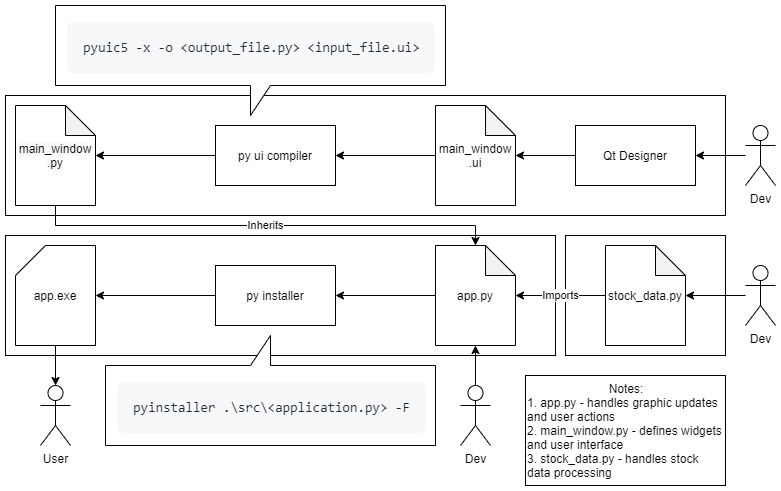

# Dev Notes

## Installing Requirements
There are some dependencies required, they're all recorded in the `requirements.txt`. Use the following command from root folder:
```
pip install -r requirements.txt
```
You can also use virtual environment to keep the dependencies from cluttering your computer:
```
pip install virtualenv
virtualenv venv
pip install -r requirements.txt
venv\Scripts\activate
```
To deactivate venv: `deactivate`

## Compiling `.ui` into `.py`
The `.ui` files are created and is editable using Qt Designer which can be downloaded here: https://build-system.fman.io/qt-designer-download

To compile the UI files, use the following command:
```
pyuic5 -x -o .\src\<output_file.py> .\src\<input_file.ui>
```

## Compiling Application `.exe`
To compile `.py` application into an executable, use the following command from root folder:
```
pyinstaller .\src\<application.py> -F
```
The `.exe` file can be found inside `dist` folder.

## Dev Process

